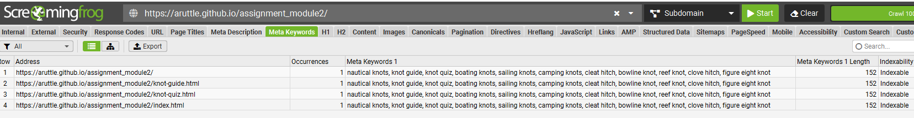

## Submission readme.md file
Github-pages: URL:
    https://aruttle.github.io/assignment_module2/

Github-repo: URL:
    https://github.com/aruttle/assignment_module2
    https://github.com/aruttle/assignment-module-2

## Site Map

---
[Link to view the image](./docs/site-map-flow.png)

### Site Map Address 
    https://aruttle.github.io/assignment_module2/
    https://aruttle.github.io/assignment_module2/knot-guide.html
    https://aruttle.github.io/assignment_module2/knot-quiz.html

### Site Map XML
   <?xml version="1.0" encoding="utf-8"?><!--Generated by Screaming Frog SEO Spider 21.1-->
<urlset xmlns="http://www.sitemaps.org/schemas/sitemap/0.9">
  <url>
    <loc>https://aruttle.github.io/assignment_module2/</loc>
    <lastmod>2025-02-22</lastmod>
    <changefreq>daily</changefreq>
    <priority>1.0</priority>
  </url>
  <url>
    <loc>https://aruttle.github.io/assignment_module2/knot-guide.html</loc>
    <lastmod>2025-02-22</lastmod>
    <changefreq>daily</changefreq>
    <priority>0.9</priority>
  </url>
  <url>
    <loc>https://aruttle.github.io/assignment_module2/knot-quiz.html</loc>
    <lastmod>2025-02-22</lastmod>
    <changefreq>daily</changefreq>
    <priority>0.9</priority>
  </url>
  <url>
    <loc>https://aruttle.github.io/assignment_module2/index.html</loc>
    <lastmod>2025-02-22</lastmod>
    <changefreq>daily</changefreq>
    <priority>0.8</priority>
  </url>
</urlset>

</urlset>

## Wireframes
Click [here](./docs/wireframes.pdf)

[Link to view the image](./docs/iphone-wireframe.png)

[Link to view the image](./docs/ipad-wireframe.png)

[Link to view the image](./docs/monitor-wireframe.png)

## Planning Analysis Sheet
### Website goal
    
The project aims to create an interactive knot guide and quiz app for outdoor enthusiasts, focusing on activities like sailing, camping, and climbing. It provides detailed instructions, images, and videos for various knots, along with a quiz to test users' knowledge and a leaderboard to track scores. Additionally, the app integrates real-time weather API data. By combining educational content and user engagement the platform serves as both a learning resource and a fun way for users to enhance their outdoor skills.

## Features

- **Knot Guide**: A selection of commonly used knots with step-by-step instructions, images, and videos.
- **Knot Quiz**: A fun and interactive quiz to test your knowledge about knots.
- **Weather Information**: Displays current weather information (temperature and wind speed) for a specified location.
- **Interactive Elements**: Dropdown menus for selecting knots, dynamic quiz forms, and displaying real-time weather data.

## How to Use

### 1. **Knot Guide**:
   - Select a knot from the dropdown menu to view detailed instructions, images, and a demonstration video.
   
### 2. **Knot Quiz**:
   - Answer the quiz questions to test your knowledge of knots. After completing the quiz, your score will be shown.
   - You can also save your score and see a leaderboard of top scores.

### 3. **Weather Info**:
   - The weather section displays the current temperature and wind speed for a specified location (Dublin, Ireland by default).
   - You can update the location if desired (future enhancement).
## List the working title of each page on your site.
### Home
    Goal: Provide an introduction to the app, featuring a welcome note and a brief overview of why we need knots, there will be a carousel with images of common useful sailing knots and a weather section to demo API usage. 
    
### Knot Guide 
    The Knot Guide Page is designed to teach users how to tie various knots commonly used in outdoor activities like sailing, camping, and climbing. It features a dropdown menu for selecting a specific knot, with detailed instructions, an image, and a video demonstrating the tying process. Each knot also includes a section explaining its common uses and practical applications, helping users understand when and why to use it. The page offers clear visuals and interactive learning through videos, allowing users to visualize the knot-tying process. Its main goal is to educate users on different knots, their uses, and how to tie them, making it an essential resource for outdoor enthusiasts and anyone interested in learning practical knot-tying skills.

### Knots Quiz
    The Quiz Page is designed to test users' knowledge of the knots featured on the site. It presents a series of multiple-choice questions related to the knots, their uses, and how to tie them. Users answer the questions, and the page provides immediate feedback, indicating whether the answer is correct or incorrect. The quiz is interactive, with questions shuffled randomly to maintain engagement. After completing the quiz, users are given a score, and there's an option to save their score along with their name in local storage for future reference. The page also includes a leaderboard to display the top scores, encouraging users to revisit and improve their performance. The main goal of the quiz page is to reinforce learning from the Knot Guide page and provide a fun, interactive way to test users' knot knowledge.

## List of sources
### Images
    All images used are from Pixabay:
    https://pixabay.com/illustrations/search/cleat%20hitch/
    
### Video 
    The videos used are from YouTube:
    https://youtu.be/hIdsTZTUl6E
    https://youtu.be/aewgmUeHpuE
    https://youtu.be/tFffbkXSgNI
    https://youtu.be/aprfVTaxkk0
    https://youtu.be/NOg85_tYk04
    https://youtu.be/q93YpbVEXAM

### API
    The API used is from: 
    https://api.open-meteo.com/

### Other Websites
    MDN:
    https://developer.mozilla.org/en-US/docs/Web
    Swiper:
    https://swiperjs.com/

### Logo
    The logo was created in PowerPoint.

## SEO Features
    I used meta-keywords and sitemap.xml

[Link to view the image](./docs/meta-keywords.png)

## Accessibility
   To check the accessability of the site I used a combination of Lighthouse and  Silktide. All scored high

[Link to view the image](./docs/lighthouse.png)

[Link to view the image](./docs/silktide.png)

## Site Features 
- Responsive at max-width: 1024px and max-width: 768px.
- Works in browsers Chrome, Edge and Firefox.
- The colour palette used for the visual design was in keeping with the background image sunset.
- The Navigation bar is consistent across all pages.
- The Banner is also consistent across all pages.
- Site has a Home Page and 2 content pages.
- Meta Tags used as outlined above.
- YouTube videos embedded.
- CSS Transition also added to hyperlinks and nav buttons.
- Bootstrap implemented
- API implemented 

## Future Enhancements
With more time, I would have liked to incorporate the following:
- Allow users to input their location for personalized weather updates.
- Add more knots and quizzes to enhance the content.
- Improve error handling in case of API failures.
- Provide users with the option to save and track their quiz scores over time.
 

## Challenges
During the development I came across many coding challenges, using MDN, our college notes and some AI queries I was able to solve most, some examples: 
    Images used were being cropped so I found a line of css to fix this: 

Also trying to get the quiz function to work. Initially it worked but kept returning to the first question if user answers incorrectly. Questions also repeat which was not ideal:

I managed to get this working in the end but would have liked to add more functionality to it if I had more time.

Another issue I faced, Vscode uninstalled itself from my pc, which was worrying (as I use Vscode everyday in my day job). Its not an unknown issue:    

I was able to reinstall it but had issues cloning the repo again, that is why there two links. 

One very strange issue I came across in Vscode was a failed to tokenize error, I could not use the comparison symbol '<=' even in the comments. I have still not fixed this issue yet even after speaking to experienced developers and web searches: 

